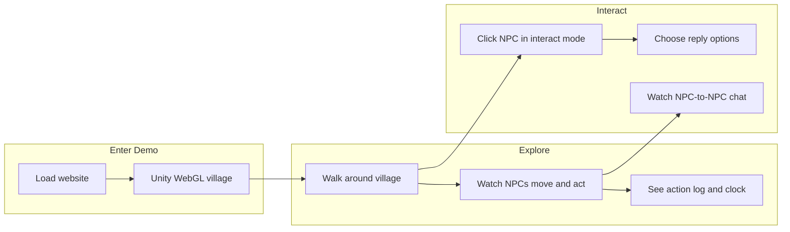
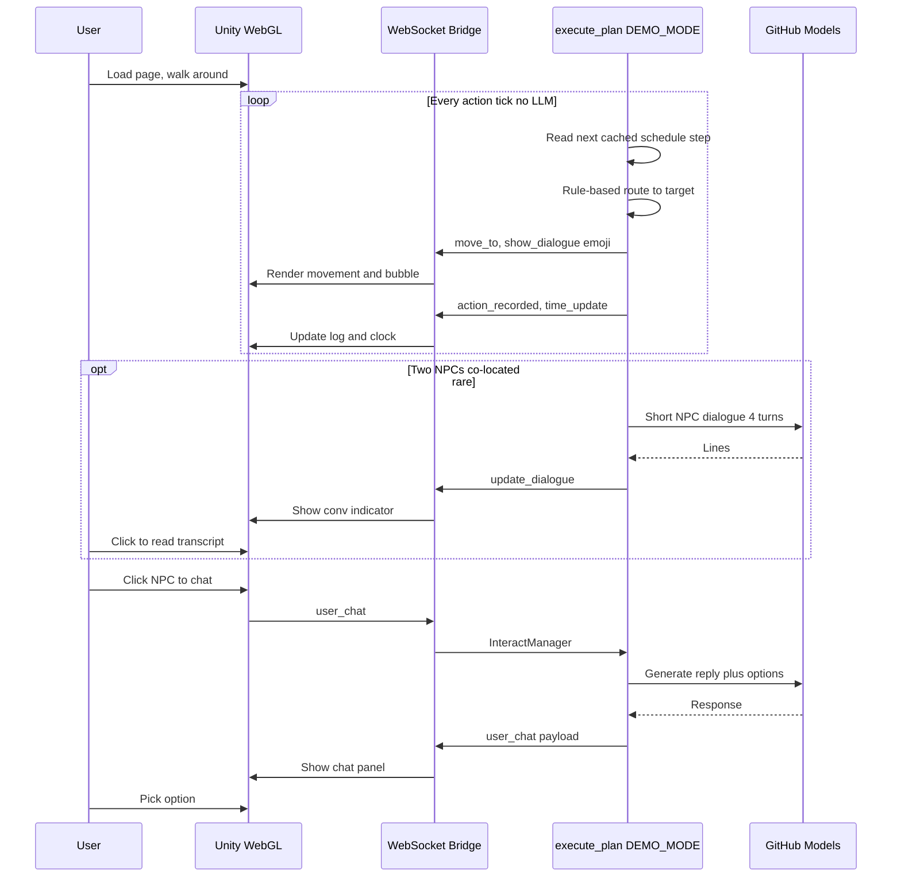
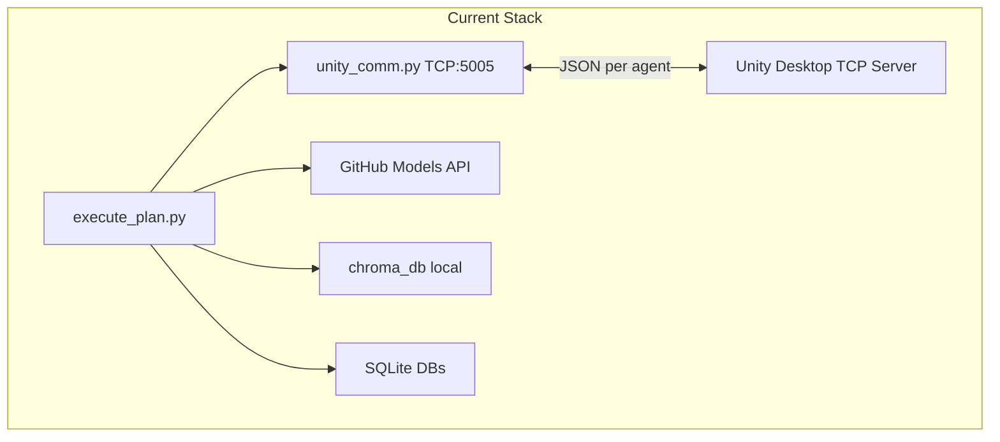
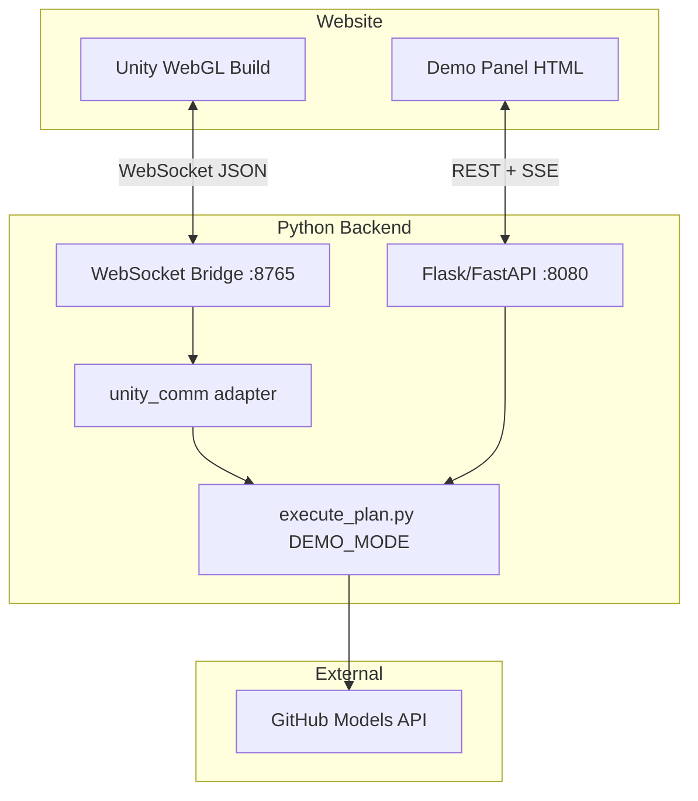

# Web Demo Prototype Report

## Executive summary

Your project is a **Python multi-agent LLM simulation** ([`Backend/execute_plan.py`](Backend/execute_plan.py)) driving a **Unity 3D client** over **raw TCP JSON** ([`Backend/unity_comm.py`](Backend/unity_comm.py)). There is **no web frontend today** — only a stale Flask test server ([`Backend/debug_server.py`](Backend/debug_server.py)) and archived FastAPI chat ([`Backend/archive/api.py`](Backend/archive/api.py)).

Your chosen target — **light live sim + Unity WebGL** — is achievable, but requires three non-negotiable changes:

1. **Add a WebSocket bridge** (Unity WebGL cannot open raw TCP sockets to `127.0.0.1:5005`)
2. **Introduce a `DEMO_MODE` config** to cap agents and disable high-cost LLM modules
3. **Build a thin website shell** (WebGL canvas + sidebar panel for clock, action log, chat, API usage)

Without scaling down, a single full sim day with 6 agents can exceed GitHub Models' **~150 requests/day per model** limit within hours — mainly via NPC conversations and (if enabled) observations.

**Your refined approach:** treat the demo as a **living village visitors can explore**. NPCs follow believable daily routines (mostly scripted), occasionally talk to each other (short live LLM), and respond when the player walks up and chats (live LLM). Invisible systems — planning, routing, observation, reflection, commitment — do **not** need to run in real time; they can reuse cached data with light randomization so the village still feels alive without burning API quota.

---

## Visitor workflow (what users actually experience)



### Step-by-step user journey

1. **Land on demo page** — Unity WebGL loads the village scene; a slim sidebar shows sim time and a scrolling action log ("Wilton: baking bread at Bakery", "Heath: playing in square").
2. **Walk around** — player moves through the map (existing Unity movement). NPCs are visible moving between locations, playing emote bubbles, and occupying objects (till, bench, oven).
3. **Watch ambient life (no LLM)** — NPCs loop through pre-authored daily tasks from cached schedules. Tasks can be **randomly swapped** between compatible slots (e.g. "sweep bakery" ↔ "knead dough") so repeat visits don't look identical. Routing is rule-based lookup in the environment tree — no LLM.
4. **Observe NPC-to-NPC conversation (limited LLM)** — when two NPCs end up in the same area, a conversation indicator appears. User can click to read the transcript. Backend generates a **short** live dialogue (4 turns max in demo mode).
5. **Talk to an NPC (main LLM feature)** — user enters interact mode, clicks an NPC, picks a starter question, then chooses from LLM-generated reply options. This is the primary "interactive AI" moment for the FYP demo.
6. **Leave** — session ends; backend keeps sim running for the next visitor or pauses when idle to save quota.

### What the user sees vs what runs behind the scenes

| User-visible | Backend behaviour | LLM at runtime? |
|--------------|-------------------|-----------------|
| NPC walks to bakery, bakes bread | Cached schedule step + rule-based route | **No** |
| Emoji bubble above NPC | Pre-authored emoji from schedule | **No** |
| Action log entry | `action_recorded` from sim loop | **No** |
| Sim clock ticking | `SimulationClock` (slowed for demo) | **No** |
| Two NPCs chatting | Short `ConversationManager` run | **Yes** (capped) |
| Player chat with NPC | `InteractManager` option flow | **Yes** (primary) |
| NPC "reflecting" bubble | Optional — can show static text or skip | **No** (disabled) |
| Plan changes mid-day | Not shown — schedules loop or swap | **No** |

---

## Module strategy: live vs scripted

Split modules into two tiers aligned with your idea:

### Backstage (scripted / cached — zero or minimal LLM)

| Module | Demo approach |
|--------|---------------|
| **Planning** | Load fixed daily loops from `plans.db` or new `demo_schedules.json`. On each "new day" or reset, **shuffle 1–2 task slots** from a pool of compatible alternatives (same area/time window). |
| **Routing** | Always use rule-based paths in [`environment_tree.py`](Backend/World_Environment/environment_tree.py) (type_1/2/3). Never call `routing_llm`. |
| **Observation** | Off. Optionally append a static log line from the schedule text instead. |
| **Reflection** | Off. Skip "Reflecting…" or show a canned 2s bubble. |
| **Commitment** | Off. No mid-day plan rewrites. |
| **Preference / impression** | Off at runtime. Use static relationship hints already in `agent_state.json` tone blocks. |

**Random task switching example** (no LLM):

```json
{
  "Wilton": {
    "loop": [
      {"time": "09:00", "action": "Open the bakery", "target": "Bakery", "emoji": "🍞"},
      {"time": "10:00", "pool": ["Knead dough", "Serve customers", "Sweep the floor"], "target": "Bakery"},
      {"time": "12:00", "action": "Walk to the square", "target": "Market_Square", "emoji": "🚶"}
    ]
  }
}
```

At reset or each loop cycle, pick one item from `pool` at random. Same visible variety, zero API cost.

### Frontstage (live LLM — what makes the demo impressive)

| Module | Demo approach |
|--------|---------------|
| **Player chat** | Always live via `InteractManager` — this is the headline feature. |
| **NPC-to-NPC dialogue** | Live but rare and short (cooldown + max 4 turns). |
| **Memory retrieval (Chroma)** | Keep for player chat context — local, free. |

**LLM budget concentrates on what visitors can directly experience: talking to NPCs and occasionally reading an NPC conversation.**

---

## End-to-end runtime workflow



### Single continuous loop (backend)

1. **Tick** — every ~0.05s, check for player messages and advance sim clock.
2. **Schedule driver** — for each active NPC, if not busy/chatting, pop next step from cached loop (with random pool resolution).
3. **Move + act** — rule-based routing → `move_to` → occupy object → log action. **No LLM.**
4. **Co-location check** — if two NPCs share an area and cooldown elapsed → trigger short NPC chat (**LLM**).
5. **Player interrupt** — if `user_chat` arrives, pause that NPC's schedule step, run `InteractManager` (**LLM**), resume when chat ends.
6. **Loop day** — instead of `generate_plans()`, rewind schedule index and re-shuffle random pool slots.

---

## Current architecture



| Layer | Technology | Key files |
|-------|------------|-----------|
| Orchestrator | LangGraph + thread pool | [`Backend/execute_plan.py`](Backend/execute_plan.py) |
| Unity bridge | TCP JSON, 1 conn/agent | [`Backend/unity_comm.py`](Backend/unity_comm.py) |
| LLM gateway | GitHub Models via LangChain | [`Backend/Secure/llm_config.py`](Backend/Secure/llm_config.py) |
| Memory | Chroma (local embed) + SQLite | [`Backend/chroma_client.py`](Backend/chroma_client.py), [`Backend/agent_memory.py`](Backend/agent_memory.py) |
| Agents | 6 NPCs | [`Backend/World_Environment/agent_state.json`](Backend/World_Environment/agent_state.json) |
| Clock | `time_scale=150` (~9.6 real min/sim day) | [`Backend/World_Environment/simulation_clock.py`](Backend/World_Environment/simulation_clock.py) |

**7 LLM-powered modules** (from README): Planning, Routing, Preference, Conversation, Commitment, Observation, Reflection.

---

## LLM cost analysis (the main budget risk)

### Hard constraint

GitHub Models free tier: **~150 API calls/day per model** ([`Backend/README.md`](Backend/README.md)). Your counter tracks usage locally ([`Backend/Secure/request_counter.json`](Backend/Secure/request_counter.json)) but does **not block** overages.

### Models in use

| Client | Model | Primary trigger |
|--------|-------|-----------------|
| `dialogue_llm` | `openai/gpt-4.1-nano` | Every dialogue turn (NPC + player) |
| `planner_llm` | `mistral-ai/mistral-medium-2505` | 4 calls/agent/sim day |
| `impression_llm` | `microsoft/Phi-4` | 2 directed pairs after each NPC chat |
| `commitment_llm` | `openai/gpt-4.1-mini` | 1–3 calls when invitation detected |
| `reflect_llm` | `mistral-ai/Ministral-3B` | 2 calls per reflection event |
| `routing_llm` | `meta/Llama-3.2-11B-Vision-Instruct` | ~10% of routes (132/1285 in [`routingCount.json`](Backend/World_Environment/routingCount.json)) |
| `observe_llm` | `meta/Meta-Llama-3.1-8B-Instruct` | 1/action (**disabled** at line 191) |

### Estimated call volume (full 6-agent sim)

| Feature | Calls per trigger | Demo-day estimate (6 agents) |
|---------|-------------------|------------------------------|
| Daily planning | 4/agent | **24** (`planner_llm`) |
| Agent actions | ~31 steps/agent/day | movement only (no LLM unless co-located) |
| Observations | 1/step | **~186** if enabled — **must stay off** |
| NPC conversation | ~15–25/conv (turns + status + summary + impressions) | **2–4 conv/day → 30–100** (`dialogue_llm` + `impression_llm`) |
| Reflection | 2/event | sporadic, **10–20/day** if memories accumulate |
| Commitment | 1–3/conv with invite | **5–15/day** |
| LLM routing | ~10% of moves | **~20/day** |
| Player chat | 1–2/turn, max 12 turns | **2–24/session** |

**Full sim easily exceeds 150/day on `dialogue_llm` alone** after a few NPC conversations + a handful of visitor chats.

### One NPC conversation breakdown ([`conversation_manager.py`](Backend/conversation_manager.py))

- `MAX_TERNS=10` + 2 extra → up to **14 turns** for 2 agents
- Each turn: 1× `dialogue_llm` via LangGraph
- After turn 6: status check every 2 turns → +4 more calls
- Post-conv: 2× summary + 2× impression + optional commitment
- **Total: ~20–25 LLM calls per 2-agent conversation**

---

## What to scale down (aligned with backstage vs frontstage)

Your instinct is correct: **only dialogue-facing modules need live LLM**. Everything else can be cached or faked convincingly.

### Backstage — replace with scripts (zero LLM)

| Module | Action | Savings |
|--------|--------|---------|
| **Planning** | `demo_schedules.json` loops + random pool swaps; never call `generate_plans()` | **24 calls/day** |
| **Routing** | Rule-based only in [`environment_tree.py`](Backend/World_Environment/environment_tree.py) | **~20 calls/day** |
| **Observation** | Off; schedule text feeds action log instead | **~165 calls/day** |
| **Reflection** | Off | **10–20 calls/day** |
| **Commitment** | Off | **5–15 calls/day** |
| **Impression** | Off; use static tone from `agent_state.json` | **2× per conv** |

### Frontstage — keep live but capped

| Module | Demo setting | Rationale |
|--------|--------------|-----------|
| **Player chat** | Always on — main demo feature | ~2 calls/turn; this is what FYP reviewers interact with |
| **NPC conversations** | Rare + short: cooldown 900s, max 4 turns, skip summary | Ambient life without quota spikes |
| **Agent count** | 3 NPCs (Wilton, Kaelyn, Heath) | Enough co-location for occasional convs |
| **Pacing** | `ACTION_DURATION=8s`, `TIME_SCALE=60` | Easier to follow while walking/watching |

### Recommended `DEMO_MODE` budget (30-min session, 3 agents)

| Model | Estimated calls |
|-------|-----------------|
| `gpt-4.1-nano` (dialogue) | 40–70 (1–2 NPC convs + 3–5 player chats) |
| `mistral-medium-2505` (planner) | **0** (cached plans) |
| `Phi-4` (impression) | **0** (disabled) |
| `gpt-4.1-mini` (commitment) | **0** (disabled) |
| `Ministral-3B` (reflect) | **0** (disabled) |
| Llama routing | **0** (rule-only) |

**Target: stay under 80 dialogue calls per demo session**, leaving headroom for multiple visitors within the 150/day cap.

---

## Proposed demo architecture



### Critical: Unity WebGL networking

Current code uses **TCP sockets** ([`unity_comm.py:51`](Backend/unity_comm.py)). **WebGL builds cannot use `System.Net.Sockets` to arbitrary hosts.** You need:

1. **Python WebSocket server** (`websockets` or `Flask-SocketIO`) that speaks the same JSON command schema as today
2. **Unity WebGL client** using a WebSocket library (e.g. Native WebSocket plugin) instead of TCP listener
3. **Deployment**: backend on a VPS/cloud with WSS (TLS); static site hosts WebGL + panel

For local dev, a **WebSocket-to-TCP proxy** can bridge existing Unity desktop builds while WebGL client is being built.

### Website panel (sidebar alongside WebGL)

Reuse concepts from existing Unity UI docs (gitignored under `Unity_Script/`):

| Panel section | Data source | Real-time method |
|---------------|-------------|------------------|
| Sim clock | `time_update` events | SSE or WebSocket fan-out |
| Action log | `action_recorded` events | SSE stream |
| Agent status | area state + `is_chatting` | REST poll every 2s |
| Player chat | `InteractManager` | REST (`/user-chat/*`) |
| LLM usage meter | `request_counter.json` | REST `/stats` |
| Demo controls | Start/pause/reset | REST POST |

Fix stale import in [`debug_server.py:7`](Backend/debug_server.py): `UserToAgentInteractManager` → `InteractManager`.

---

## Implementation roadmap

### Phase 1 — Scripted schedules + demo config (1–2 days)

Add [`Backend/demo_schedules.json`](Backend/demo_schedules.json) — per-agent task loops with optional `pool` arrays for random slot swapping.

Add [`Backend/demo_config.py`](Backend/demo_config.py):

```python
DEMO_MODE = True
DEMO_AGENTS = ["Wilton", "Kaelyn", "Heath"]
USE_DEMO_SCHEDULES = True      # replaces live planner
USE_CACHED_PLANS = False       # or fallback to plans.db if schedules missing
ENABLE_OBSERVATIONS = False
ENABLE_REFLECTION = False
ENABLE_COMMITMENT = False
ENABLE_LLM_ROUTING = False
ENABLE_IMPRESSION_UPDATES = False
CONVERSATION_COOLDOWN = 900
MAX_TURNS = 4
ACTION_DURATION = 8.0
TIME_SCALE = 60.0
SHUFFLE_POOL_ON_LOOP = True    # random task swap when schedule loops
```

Wire flags into [`execute_plan.py`](Backend/execute_plan.py) (schedule driver instead of `generate_plans()`), [`conversation_manager.py`](Backend/conversation_manager.py), [`environment_tree.py`](Backend/World_Environment/environment_tree.py).

**Validate**: run 30-min session; confirm NPCs loop believably with zero planner/routing LLM calls; dialogue counter stays under 80.

### Phase 2 — REST demo API + panel (2–3 days)

Extend [`debug_server.py`](Backend/debug_server.py) (or new `demo_server.py`):

- `GET /health`, `GET /stats` (LLM counters, sim time, active agents)
- `GET /agents`, `GET /action-log` (SSE stream)
- Fix and expose player chat endpoints using `InteractManager`
- `POST /demo/reset` — reset to cached state without replanning

Build minimal static panel (`demo/index.html` + JS): embed placeholder for WebGL, sidebar with clock/log/chat/stats.

### Phase 3 — WebSocket bridge for Unity WebGL (3–5 days)

- New [`Backend/ws_bridge.py`](Backend/ws_bridge.py): multiplex agent connections over WebSocket (agent_id in handshake or first message)
- Refactor [`unity_comm.py`](Backend/unity_comm.py): abstract transport behind `TransportInterface` (TCP for desktop dev, WebSocket for web)
- Unity side: replace TCP listener with WebSocket client connecting to backend URL (env-configurable)

### Phase 4 — Unity WebGL build + website shell (2–4 days)

- Unity build settings: WebGL template with loading bar
- Host on static site (GitHub Pages / Netlify)
- Backend on Render/Railway/Fly.io with `GITHUB_TOKEN` as secret
- CORS + WSS configuration

### Phase 5 — Polish for FYP presentation

- Pre-warm Chroma with demo memories (reset script)
- Fallback: if LLM quota hit, serve cached dialogue snippets
- Display "API calls remaining today" in panel
- Optional: pause sim when no visitors (save quota)

---

## Files requiring changes (summary)

| File | Change |
|------|--------|
| [`Backend/demo_schedules.json`](Backend/demo_schedules.json) | **New** — scripted loops + random task pools |
| [`Backend/execute_plan.py`](Backend/execute_plan.py) | Filter agents, skip replan, respect demo flags |
| [`Backend/conversation_manager.py`](Backend/conversation_manager.py) | Shorter turns, skip summary/impression in demo |
| [`Backend/World_Environment/environment_tree.py`](Backend/World_Environment/environment_tree.py) | Skip LLM routing fallback |
| [`Backend/reflection_manager.py`](Backend/reflection_manager.py) | Early return if disabled |
| [`Backend/commitment_manager.py`](Backend/commitment_manager.py) | Skip assign_commitment in demo |
| [`Backend/debug_server.py`](Backend/debug_server.py) | Fix imports, add stats/SSE endpoints |
| [`Backend/ws_bridge.py`](Backend/ws_bridge.py) | **New** — WebSocket transport |
| [`Backend/unity_comm.py`](Backend/unity_comm.py) | Transport abstraction |
| Unity project (external) | WebSocket client, WebGL build |
| `demo/index.html` | **New** — website shell + panel |

---

## Risks and mitigations

| Risk | Impact | Mitigation |
|------|--------|------------|
| GitHub Models 150/day limit | Demo breaks mid-session | `DEMO_MODE` caps + live counter + cached fallback dialogue |
| WebGL cannot use TCP | Unity won't connect | WebSocket bridge (Phase 3) — **blocker for web deployment** |
| Long LLM latency (10–20s timeout) | UI feels frozen | Show loading states; reduce `max_tokens` in demo; async conv generation |
| Stale `debug_server.py` | Chat endpoints broken | Fix `InteractManager` import in Phase 2 |
| Multi-visitor concurrency | Quota exhaustion | Single shared sim instance; queue player chats |
| Chroma/SQLite state drift | Inconsistent demo | `demo/reset` script restores snapshot DBs |

---

## Prototype success criteria

1. Visitor loads WebGL village and can **walk around freely**
2. 3 NPCs follow **scripted daily loops** with occasional random task swaps — no planner/routing LLM
3. Action log and clock update in real time as NPCs move and act
4. Visitor can **click an NPC and chat** (live LLM — primary demo feature)
5. Visitor can **watch a short NPC-to-NPC conversation** when two agents meet (live LLM, capped)
6. Invisible modules (planning, routing, reflection, commitment) never block or delay the visible experience
7. Total LLM usage stays under **80 calls per 30-min session** on `gpt-4.1-nano`

---

## Recommended next step

Start with **Phase 1 only** (demo config + cost validation on desktop Unity/TCP). This proves the LLM budget before investing in WebSocket/WebGL infrastructure. Once counters look good, proceed to Phase 2 panel and Phase 3 WebGL bridge in parallel.
